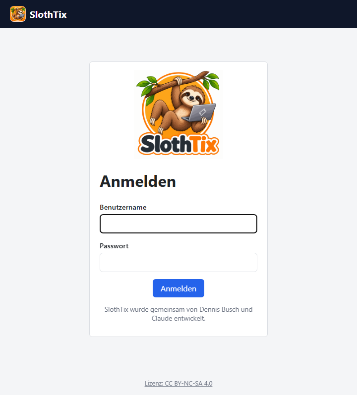
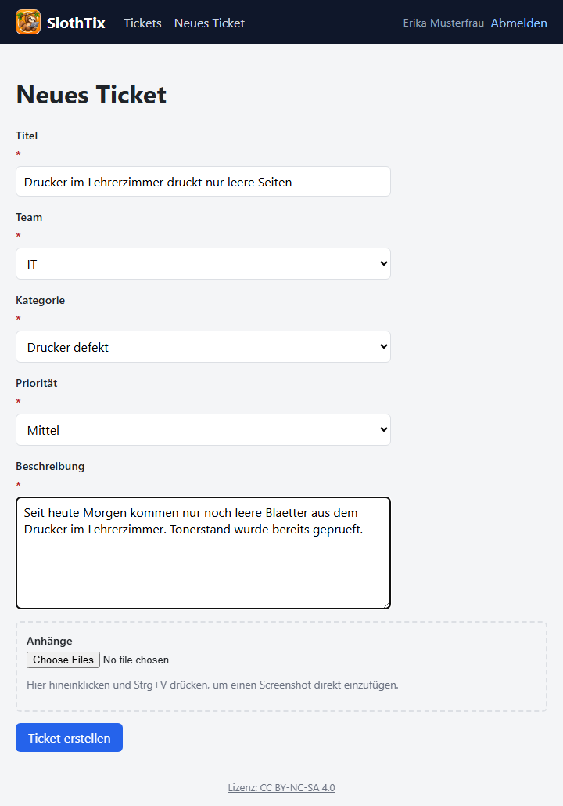
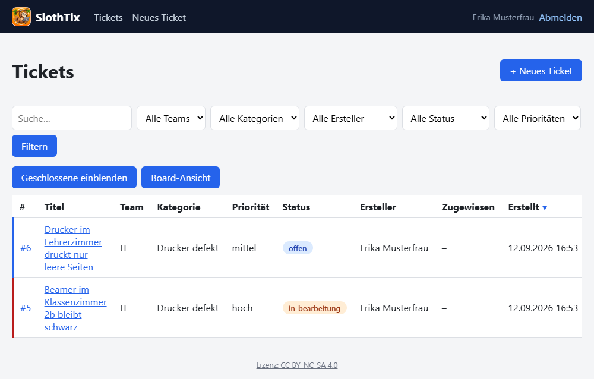
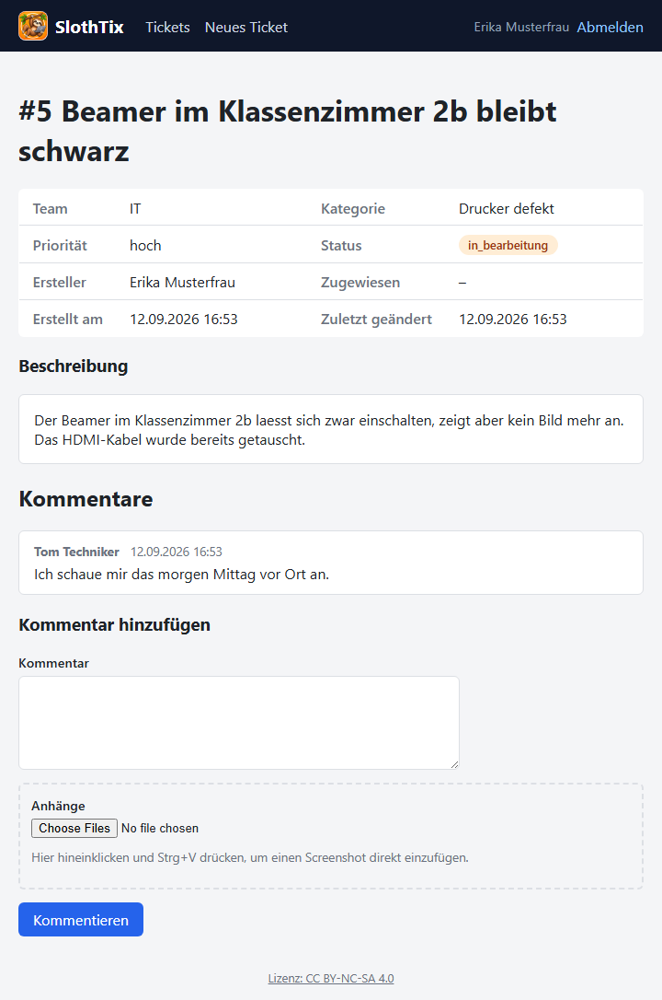

# SlothTix – Handbuch für Nutzer

SlothTix ist das Ticket-System der Schule, um technische Probleme,
Reparaturwünsche oder ähnliche Anliegen an das zuständige Team (z. B. IT
oder Hausmeister) zu melden.

## Anmeldung

Ruf die SlothTix-Adresse eurer Schule im Browser auf und melde dich mit
deinem gewohnten Schul-Benutzernamen und -Passwort an. Ein separates
SlothTix-Konto gibt es nicht.

Falls die Anmeldung nicht klappt, obwohl die Zugangsdaten stimmen: Wende
dich an die IT – möglicherweise ist dein Konto noch nicht für SlothTix
freigeschaltet.

## Ein neues Ticket erstellen

1. Oben auf **„Neues Ticket"** klicken.
2. **Titel**: Kurze, aussagekräftige Beschreibung des Problems.
3. **Team**: Das zuständige Team auswählen (z. B. „IT" bei einem
   Computer-Problem, „Hausmeister" bei einem baulichen Anliegen). Es ist
   bewusst nichts vorausgewählt – bitte bewusst das richtige Team wählen,
   damit dein Anliegen nicht beim falschen Team landet.
4. **Kategorie**: Passende Kategorie zum gewählten Team auswählen (die
   Liste passt sich automatisch an das gewählte Team an).
5. **Priorität**: Niedrig / Mittel / Hoch – bitte realistisch einschätzen.
6. **Beschreibung**: So genau wie möglich beschreiben, was nicht
   funktioniert bzw. was benötigt wird.
7. **Anhänge (optional)**: Ein Screenshot sagt oft mehr als viele Worte.
   Am schnellsten geht das per **Copy & Paste**: Screenshot aufnehmen
   (z. B. mit dem Windows-Snipping-Tool), in das gestrichelte Feld
   „Anhänge" klicken und **Strg+V** drücken. Das Bild erscheint direkt als
   Vorschau (mit „✕" wieder entfernbar) und wird beim Absenden mit
   übertragen.
8. Auf **„Ticket erstellen"** klicken.

Pflichtfelder sind mit einem roten `*` markiert. Fehlt eine Angabe, macht
dich SlothTix direkt beim entsprechenden Feld darauf aufmerksam.

## Den Status deiner Tickets verfolgen

Unter **„Tickets"** siehst du eine Übersicht all deiner eigenen Tickets mit
aktuellem Status:

- **Offen**: noch nicht bearbeitet
- **In Bearbeitung**: ein Teammitglied kümmert sich gerade darum
- **Gelöst**: erledigt
- **Geschlossen**: abgeschlossen und archiviert

Geschlossene Tickets sind standardmäßig ausgeblendet – über den Button
**„Geschlossene einblenden"** lassen sie sich bei Bedarf wieder anzeigen.

Ein Klick auf ein Ticket öffnet die Detailansicht mit allen Informationen,
bisherigen Kommentaren und der Möglichkeit, selbst zu kommentieren.

## Kommentieren

In der Ticket-Detailansicht kannst du unter „Kommentar hinzufügen" weitere
Informationen ergänzen (z. B. „Problem tritt jetzt auch bei einem anderen
Gerät auf") – auch hier lassen sich wieder Screenshots per Strg+V
anhängen. Deine Kommentare sind immer öffentlich sichtbar für das
zuständige Team.

Manche Kommentare eines Teams sind als „intern" markiert – die siehst du
nicht, da sie nur der teaminternen Abstimmung dienen.

## Benachrichtigungen

Du bekommst automatisch eine E-Mail, wenn:
- jemand aus dem zuständigen Team öffentlich auf dein Ticket antwortet,
- sich der Status deines Tickets ändert (z. B. auf „Gelöst").

So musst du nicht aktiv nachschauen, ob sich etwas getan hat.
